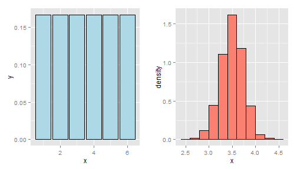
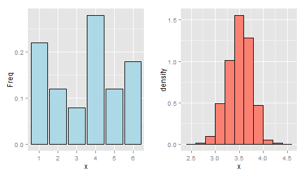
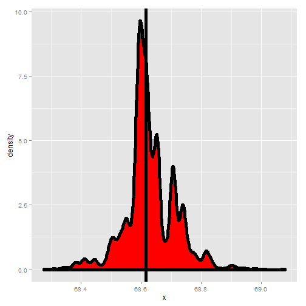
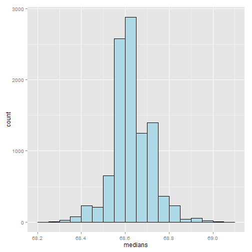
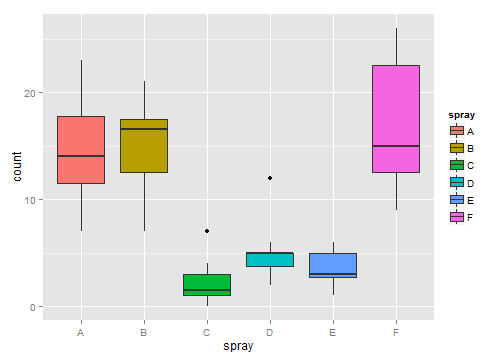
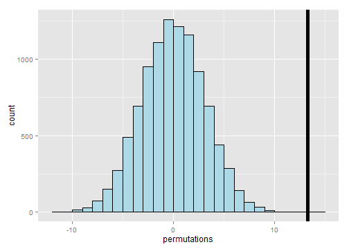

# The bootstrap and resampling

## The bootstrap
[Watch this video before beginning.](http://youtu.be/0hNQx9nagq4?list=PLpl-gQkQivXiBmGyzLrUjzsblmQsLtkzJ)

The bootstrap is a tremendously useful tool for constructing confidence intervals and
calculating standard errors for difficult statistics.
For a classic example, how would one derive a confidence interval for the median?
The bootstrap procedure follows from the so called bootstrap principle

To illustrate the bootstrap principle, imagine a die roll. The image below shows the
mass function of a die roll on the left. On the right we show the empirical distribution
obtained by repeatedly averaging 50 independent die rolls. By this simulation, without
any mathematics, we have a good idea of what the distribution of averages of 50 die
rolls looks like.

 

Now imagine a case where we didn't know whether or not the die was fair. We have a sample of
size 50 and we'd like to investigate the distribution of the average of 50 die rolls
*where we're not allowed to roll the die anymore*. This is more like a real data analysis, we only get one sample
from the population.

 

The bootstrap principle is to use the empirical mass function of the data to perform the simulation,
rather than the true distribution. That is, we simulate averages of 50 samples
from the histogram that we observe. With enough data, the empirical distribution should be a good estimate of the
true distribution and this should result in a good approximation of the sampling distribution.

That's the bootstrap principle: investigate the sampling distribution of a statistic by simulating repeated
realizations from the observed distribution.

If we could simulate from the true distribution, then we would know the exact sampling distribution of our statistic (if we
  ran our computer long enough.) However, since we only get to sample from that distribution once, we have to be
content with using the empirical distribution. This is the clever idea of the bootstrap.

### Example Galton's fathers and sons dataset

[Watch this video before beginning.](http://youtu.be/yNTWcmbWvWg?list=PLpl-gQkQivXiBmGyzLrUjzsblmQsLtkzJ)

The code below creates resamples via draws of size n with replacement with the original data
 of the son's heights from Galton's data
and plots a histogram of the median of each resampled dataset.

{title="Bootstrapping example:", lang=r, line-numbers=off}
~~~
library(UsingR)
data(father.son)
x <- father.son$sheight
n <- length(x)
B <- 10000
resamples <- matrix(sample(x, n * B, replace = TRUE), B, n)
resampledMedians <- apply(resamples, 1, median)
~~~

 

## The bootstrap principle

[Watch this video before beginning.](http://youtu.be/BKrMjX7FBno?list=PLpl-gQkQivXiBmGyzLrUjzsblmQsLtkzJ)

Suppose that I have a statistic that estimates some population parameter, but I don't know its sampling distribution.
The bootstrap principle suggests using the distribution defined by the data to approximate its sampling distribution

### The bootstrap in practice

In practice, the bootstrap principle is always carried out using simulation.
We will cover only a few aspects of bootstrap resampling.
The general procedure follows by first simulating complete data sets from the observed data with replacement.
This is approximately drawing from the sampling distribution of that statistic, at least as far as the data is
able to approximate the true population distribution. Calculate the statistic for each simulated data set
Use the simulated statistics to either define a confidence interval or take the standard deviation to calculate a standard error.

### Nonparametric bootstrap algorithm example

Bootstrap procedure for calculating confidence interval for the median from a data set of {$$}n{/$$} observations:

1. Sample {$$}n{/$$} observations **with replacement** from the observed data resulting in one simulated complete data set.
2. Take the median of the simulated data set
3. Repeat these two steps {$$}B{/$$} times, resulting in {$$}B{/$$} simulated medians
4. These medians are approximately drawn from the sampling distribution of the median of {$$}n{/$$} observations; therefore we can:

    - Draw a histogram of them
    - Calculate their standard deviation to estimate the standard error of the median
    - Take the {$$}2.5^{th}{/$$} and {$$}97.5^{th}{/$$} percentiles as a confidence interval for the median

For the general bootstrap, just replace the median with whatever statistic that
you're investigating.

### Example code

Consider our father/son data from before. Here is
the relevant code for doing the resampling.

{lang=r, line-numbers=off}
~~~
B <- 10000
resamples <- matrix(sample(x,
                           n * B,
                           replace = TRUE),
                    B, n)
medians <- apply(resamples, 1, median)
~~~

And here is some results.

{lang=r, line-numbers=off}
~~~
sd(medians)
~~~

{lang=r, line-numbers=off}
~~~
## [1] 0.0847079
~~~

Thus, 0.084 estimates the standard error of the median for this data set. It did this
by repeatedly sampling medians from the observed distribution and taking the standard deviation
of the resulting collection of medians. Taking the 2.5 and 97.5 percentiles gives us a
bootstrap 95% confidence interval for the median.

{lang=r, line-numbers=off}
~~~
quantile(medians, c(.025, .975))
~~~

{lang=r, line-numbers=off}
~~~
##     2.5%    97.5% 
## 68.42972 68.81509
~~~

We also always want to plot a histogram or density estimate of our simulated statistic.

{lang=r, line-numbers=off}
~~~
g = ggplot(data.frame(medians = medians), aes(x = medians))
g = g + geom_histogram(color = "black", fill = "lightblue",
                       binwidth = 0.05)
g
~~~

 

### Summary notes on the bootstrap

- The bootstrap is non-parametric.
- Better percentile bootstrap confidence intervals correct for bias.
- There are lots of variations on bootstrap procedures; the book [An Introduction to the Bootstrap](http://www.crcpress.com/product/isbn/9780412042317) by Efron and Tibshirani is a great place to start for both bootstrap and jackknife information.

## Group comparisons via permutation tests

[Watch this video before beginning.](http://youtu.be/nn1t9Kk7nn8?list=PLpl-gQkQivXiBmGyzLrUjzsblmQsLtkzJ)

Consider comparing two independent groups. Example, comparing sprays B and C.

{lang=r, line-numbers=off}
~~~
data(InsectSprays)
g = ggplot(InsectSprays, aes(spray, count, fill = spray))
g = g + geom_boxplot()
g
~~~

 

## Permutation tests
Consider comparing means between the group. However, let's
use the calculate the distribution of our statistic under
a null hypothesis that the labels are irrelevant (exchangeable).
This is a handy way to create a null distribution for our
test statistic by simply permuting the labels over and over and
seeing how extreme our data are with respect to this permuted
distribution.

The procedure would be as follows:

1. consider a data from with count and spray,
2. permute the spray (group) labels,
3. recalculate the statistic (such as the difference in means),
4. calculate the percentage of simulations where
the simulated statistic was more extreme (toward
the alternative) than the observed.

## Variations on permutation testing

This idea of exchangeability of the group labels is so powerful, that it's
been reinvented several times in statistic. The table below gives three
famous tests that are obtained by permuting group labels.

|Data type | Statistic           | Test name           |
|----------|---------------------|---------------------|
|Ranks     | rank sum            | rank sum test       |
|Binary    | hypergeometric prob | Fisher's exact test |
|Raw data  |                     | permutation test    |

Also, so-called *randomization tests* are exactly permutation tests, with a
different motivation. In that case, think of the permutation test as replicating
the random assignment over and over.

For matched or paired data, it wouldn't make sense to randomize the group labels, since
that would break the association between the pairs. Instead,
one can randomize the signs of the pairs. For data that has been replaced
by ranks, you might of heard of this test before as the
the signed rank test.

Again we won't cover more complex examples, but it should be said that
permutation strategies work for regression as well by permuting a
regressor of interest (though this needs to be done with care).
These tests work very well in massively multivariate settings.

## Permutation test B v C
Let's create some code for our example. Our statistic will be the difference
in the means in each group.

{title="Permutation distribution for the insect sprays dataset.:", lang=r, line-numbers=off}
~~~
subdata <- InsectSprays[InsectSprays$spray %in% c("B", "C"),]
y <- subdata$count
group <- as.character(subdata$spray)
testStat <- function(w, g) mean(w[g == "B"]) - mean(w[g == "C"])
observedStat <- testStat(y, group)
permutations <- sapply(1 : 10000,
                       function(i) testStat(y, sample(group)))
~~~

Let's look at some of the results. First let's look at the observed statistic.

{lang=r, line-numbers=off}
~~~
observedStat
~~~

{lang=r, line-numbers=off}
~~~
## [1] 13.25
~~~

Now let's see what proportion of times we got a simulated
statistic larger than our observed statistic.

{lang=r, line-numbers=off}
~~~
mean(permutations > observedStat)
~~~

{lang=r, line-numbers=off}
~~~
## [1] 0
~~~

Since this is 0, our estimate of the P-value is 0 (i.e. we strongly reject the
  NULL). It's useful to look at a histogram of permuted statistics with a
  vertical line drawn at the observed test statistic for reference.

 

## Exercises
1. The bootstrap uses what to estimate the sampling distribution of a statistic?
  - The true population distribution
  - The empirical distribution that puts probability 1/n for each observed data point
2. When performing the bootstrap via Monte Carlo resampling for a data set of size n which is true? Assume that you're going to do 10,000 bootstrap resamples?
  - You sample n complete data sets of size 10,000 with replacement
  - You sample 10,000 complete data sets of size n without replacement
  - You sample 10,000 complete data sets of size n with replacement
  - You sample n complete data sets of size 10,000 without replacement
3. Permutation tests do what?
  - Creates a null distribution for a hypothesis test by permuting a predictor variable.
  - Creates a null distribution by resampling from the response with replacement.
  - Creates an alternative distribution by permuting group labels.
  - Creates confidence intervals by resampling with replacement.