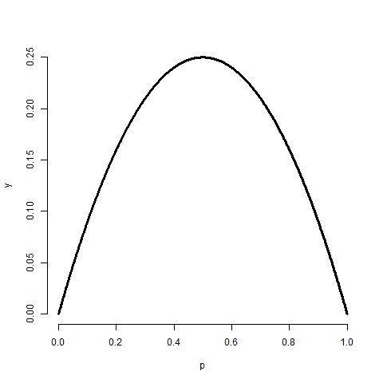

# Variation

## The variance
[Watch this video before beginning.](http://youtu.be/oLQVU-VRiHo?list=PLpl-gQkQivXiBmGyzLrUjzsblmQsLtkzJ)

Recall that the mean of distribution was a measure of its center.
The variance, on the other hand, is a measure of *spread*.
To get a sense, the plot below shows a series of increasing
variances.

We saw another example
of how variances changed in the last chapter when we looked at the distribution of averages; they were always centered
at the same spot as the original distribution, but are less spread out.
Thus, it is less likely for sample means to be far away from the population
mean than it is for individual observations. (This is why the sample mean is
  a better estimate than the population mean.)

If {$$}X{/$$} is a random variable with mean {$$}\mu{/$$}, the variance of
{$$}X{/$$} is defined as

{$$}
Var(X) = E[(X - \mu)^2] = E[X^2] - E[X]^2.
{/$$}

The rightmost equation is the shortcut formula that is almost always used
for calculating variances in practice.  
Thus the variance is the expected (squared) distance from the mean. Densities
with a higher variance are more spread out than densities with
a lower variance. The square root of the variance is called the
**standard deviation**. The main benefit of working with standard deviations
is that they have the same units as the data, whereas the variance has the
units squared.

In this class, we'll only cover a few basic examples for calculating a variance.
Otherwise, we're going to use the ideas without the formalism. Also remember, what we're talking
about is the population variance. It measures how spread out the population
of interest is, unlike the sample variance which measures how spread out the
observed data are. Just like the sample mean estimates the
population mean, the sample variance will estimate the population variance.

### Example

What's the variance from the result of a toss of a die? First recall that {$$}E[X] = 3.5{/$$}, as we discussed in the previous lecture.
Then let's calculate the other bit of information that we need, {$$}E[X^2]{/$$}.

{$$}E[X^2] = 1 ^ 2 \times \frac{1}{6} + 2 ^ 2 \times \frac{1}{6} + 3 ^ 2 \times \frac{1}{6} + 4 ^ 2 \times \frac{1}{6} + 5 ^ 2 \times \frac{1}{6} + 6 ^ 2 \times \frac{1}{6} = 15.17{/$$}

Thus now we can calculate the variance as:

{$$}Var(X) = E[X^2] - E[X]^2 \approx 2.92.{/$$}

### Example

What's the variance from the result of the toss of a
(potentially biased) coin with probability of heads (1) of {$$}p{/$$}? First recall that
{$$}E[X] = 0 \times (1 - p) + 1 \times p = p.{/$$} Secondly, recall that since {$$}X{/$$} is either 0 or 1,
{$$}X^2 = X{/$$}. So we know that:

{$$}E[X^2] = E[X] = p.{/$$}

Thus we can now calculate the variance of a coin flip as
{$$}Var(X) = E[X^2] - E[X]^2 = p - p^2 = p(1 - p).{/$$}
This is a well known formula, so it's worth committing
to memory. It's interesting to note that this function is
maximized at {$$}p = 0.5{/$$}. The plot below shows this by
plotting {$$}p(1-p){/$$} by {$$}p{/$$}.

{title="Plotting the binomial variance", line-numbers=off,lang=r}
~~~
p = seq(0 , 1, length = 1000)
y = p * (1 - p)
plot(p, y, type = "l", lwd = 3, frame = FALSE)
~~~

## The sample variance
The sample variance is the estimator of the population
variance. Recall that the population variance is the
expected squared deviation around the population mean.
The sample variance is (almost) the average squared deviation
of observations around the sample mean. It is given by

{$$}
S^2 = \frac{\sum_{i=1} (X_i - \bar X)^2}{n-1}
{/$$}

The sample standard deviation is the square root of the sample variance.
Note again that
the sample variance is almost, but not quite, the average squared deviation from
the sample mean since we divide by {$$}n-1{/$$} instead of
{$$}n{/$$}. Why do we do this you might ask? To answer that question
we have to think in the terms of simulations. Remember that the
sample variance is a random variable, thus it has a distribution
and that distribution has an associated population mean. That
mean is the population variance that we're trying to estimate
if we divide by {$$}(n-1){/$$} rather than {$$}n{/$$}.

It is also nice that as we collect more data the distribution of the
sample variance gets more concentrated around the population
variance that it's estimating.

## Simulation experiments

[Watch this video before beginning.](http://youtu.be/uPjHB9JjGKI?list=PLpl-gQkQivXiBmGyzLrUjzsblmQsLtkzJ)

### Simulating from a population with variance 1
Let's try simulating collections of standard normals and taking the variance.
If we repeat this over and over, we get a sense of the distribution of
sample variances variances.

Notice that these histograms are always centered in the same spot, 1. In
other words, the sample variance is an unbiased estimate of the population
variances. Notice also that they get more concentrated around the 1 as
more data goes into them. Thus, sample variances comprised of more observations
are less variable than sample variances comprised of fewer.

### Variances of x die rolls
Let's try the same thing, now only with die rolls instead of simulating standard
normals. In this experiment, we simulated samples of die rolls, took the
variance and then repeated that process over and over. What is plotted
are histograms of the collections of sample variances.

Recall that we calculated the variance of a die roll as 2.92 earlier on in
this chapter. Notice each of the histograms are centered there. In addition,
they get more concentrated around 2.92 as more the variances are comprised
of more dice.

## The standard error of the mean

At last, we finally get to a perhaps very surprising (and useful) fact:
how to estimate the variability of the mean of a sample, when we only get to observe
one realization.  Recall that the average of random sample from a population
is itself a random variable having a distribution, which in simulation
settings we can explore by repeated sampling averages. We know that this
distribution is centered around the population mean,
{$$}E[\bar X] = \mu{/$$}. We also know the variance of the distribution
of means of random samples.

The variance of the sample mean is: {$$}Var(\bar X) = \sigma^2 / n{/$$}
where {$$}\sigma^2{/$$} is the variance of the population being sampled
from.

This is very useful, since we don't have repeat sample means
to get its variance directly using the data. We already know a good estimate of
{$$}\sigma^2{/$$} via the sample variance. So, we can get a good estimate
of the variability of the mean, even though we only get to observe 1 mean.

Notice also this explains why in all of our simulation experiments the
variance of the sample mean kept getting smaller as the sample size
increased. This is because of the square root of the sample size in the
denominator.

Often we take the square root of the variance of the mean to get the standard
deviation of the mean. We call the standard deviation of a statistic its
standard error.

### Summary notes
* The sample variance, {$$}S^2{/$$}, estimates the population variance, {$$}\sigma^2{/$$}.
* The distribution of the sample variance is centered around {$$}\sigma^2{/$$}.
* The variance of the sample mean is {$$}\sigma^2 / n{/$$}.
  * Its logical estimate is {$$}s^2 / n{/$$}.
  * The logical estimate of the standard error is {$$}S / \sqrt{n}{/$$}.
* {$$}S{/$$}, the standard deviation, talks about how variable the population is.
* {$$}S/\sqrt{n}{/$$}, the standard error, talks about how variable averages of random
samples of size {$$}n{/$$} from the population are.

### Simulation example 1: standard normals

[Watch this video before beginning.](http://youtu.be/uPjHB9JjGKI?list=PLpl-gQkQivXiBmGyzLrUjzsblmQsLtkzJ)

Standard normals have variance 1. Let's try sampling
means of {$$}n{/$$} standard normals. If our theory is correct, they should
 have standard deviation {$$}1/\sqrt{n}{/$$}

{title="Simulating means of random normals", line-numbers=off,lang=r}
~~~
> nosim <- 1000
> n <- 10
## simulate nosim averages of 10 standard normals
> sd(apply(matrix(rnorm(nosim * n), nosim), 1, mean))
[1] 0.3156
## Let's check to make sure that this is sigma / sqrt(n)
> 1 / sqrt(n)
[1] 0.3162
~~~

So, in this simulation, we simulated 1000 means of 10 standard normals. Our
theory says the standard deviation of averages of 10 standard normals must
be {$$}1/\sqrt{n}{/$$}. Taking the standard deviation of the 10000 means yields
nearly exactly that. (Note that it's only close, 0.3156 versus 0.31632.
 To get it to be exact, we'd have to simulate
infinitely many means.)

### Simulation example 2: uniform density
Standard uniforms have variance {$$}1/12{/$$}. Our theory mandates
that means of random samples of {$$}n{/$$} uniforms
have sd {$$}1/\sqrt{12 \times n}{/$$}. Let's try it with a simulation.

{title="Simulating means of uniforms", line-numbers=off,lang=r}
~~~
> nosim <- 1000
> n <- 10
> sd(apply(matrix(runif(nosim * n), nosim), 1, mean))
[1] 0.09017
> 1 / sqrt(12 * n)
[1] 0.09129
~~~

### Simulation example 3: Poisson
Poisson(4) random variables have variance {$$}4{/$$}. Thus means of
random samples of {$$}n{/$$} Poisson(4)
should have standard deviation {$$}2/\sqrt{n}{/$$}. Again let's try it out.

{title="Simulating means of Poisson variates", line-numbers=off,lang=r}
~~~
> nosim <- 1000
> n <- 10
> sd(apply(matrix(rpois(nosim * n, 4), nosim), 1, mean))
[1] 0.6219
> 2 / sqrt(n)
[1] 0.6325
~~~

### Simulation example 4: coin flips
Our last example is an important one. Recall that the variance of a
coin flip is {$$}p (1 - p){/$$}. Therefore the standard deviation of the average
of {$$}n{/$$} coin flips should be {$$}\sqrt{\frac{p(1-p)}{n}}{/$$}.

Let's just do the simulation with a fair coin. Such coin
flips have variance 0.25. Thus means of
random samples of {$$}n{/$$} coin flips have sd {$$}1 / (2 \sqrt{n}){/$$}.
Let's try it.

{title="Simulating means of coin flips", line-numbers=off,lang=r}
~~~
> nosim <- 1000
> n <- 10
> sd(apply(matrix(sample(0 : 1, nosim * n, replace = TRUE),
                nosim), 1, mean))
[1] 0.1587
> 1 / (2 * sqrt(n))
[1] 0.1581
~~~

## Data example
[Watch this before beginning.](http://youtu.be/Lm2DMVyZVxk?list=PLpl-gQkQivXiBmGyzLrUjzsblmQsLtkzJ)

Now let's work through a data example to show how the standard error of the
mean is used in practice. We'll use the `father.son` height data from Francis
Galton.

{title="Loading the data", line-numbers=off,lang=r}
~~~
library(UsingR); data(father.son);
x <- father.son$sheight
n<-length(x)
~~~

Here's a histogram of the sons' heights from the dataset.
Let' calculate different variances and interpret them in this context.

{title="Loading the data", line-numbers=off,lang=r}
~~~
>round(c(var(x), var(x) / n, sd(x), sd(x) / sqrt(n)),2)
[1] 7.92 0.01 2.81 0.09
~~~

The first number, 7.92, and its square root, 2.81, are the estimated variance
and standard deviation of the sons' heights. Therefore, 7.92 tells us exactly how variable
sons' heights were in the data and estimates how variable sons' heights are
in the population. In contrast 0.01, and the square root 0.09, estimate how
variable averages of {$$}n{/$$} sons' heights are.

Therefore, the smaller numbers discuss the precision of our estimate of the mean
of sons' heights. The larger numbers discuss how variable sons' heights are in general.

## Summary notes
* The sample variance estimates the population variance.
* The distribution of the sample variance is centered at
what its estimating.
* It gets more concentrated around the population variance with larger sample sizes.
* The variance of the sample mean is the population variance
divided by {$$}n{/$$}.
  * The square root is the standard error.
* It turns out that we can say a lot about the distribution of
averages from random samples,
even though we only get one to look at in a given data set.

## Exercises
1. If I have a random sample from a population, the sample variance is an estimate of?
  - The population standard deviation.
  - The population variance.
  - The sample variance.
  - The sample standard deviation.
2. The distribution of the sample variance of a random sample from a population is centered at what?
  - The population variance.
  - The population mean.
3. I keep drawing samples of size {$$}n{/$$} from a population with variance {$$}\sigma^2{/$$} and taking their average. I do this thousands of times. If I were to take the variance of the collection of averages, about what would it be?
4. You get a random sample of {$$}n{/$$} observations from a population and take their average. You would like to estimate the variability of averages of {$$}n{/$$} observations from this population to better understand how precise of an estimate it is. Do you need to repeated collect averages to do this?
  - No, we can multiply our estimate of the population variance by {$$}1/n{/$$} to get a good estimate of the variability of the average.
  - Yes, you have to get repeat averages.
5. A random variable takes the value -4 with probability .2 and 1 with probability .8. What
is the variance of this random variable? [Watch a video solution to this problem.](http://youtu.be/Em-xJeQO1rc?list=PLpl-gQkQivXhHOcVeU3bSJg78zaDYbP9L)
and [look at a version with a worked out solution.](http://bcaffo.github.io/courses/06_StatisticalInference/homework/hw1.html#6)
6. If {$$}\bar X{/$$} and {$$}\bar Y{/$$} are comprised of n iid random variables arising from distributions
having  means {$$}\mu_x{/$$} and {$$}\mu_y{/$$}, respectively and common variance
{$$}\sigma^2{/$$}
what is the variance {$$}\bar X - \bar Y{/$$}?
[Watch a video solution to this problem here](http://youtu.be/7zJhPzX6jns?list=PLpl-gQkQivXhHOcVeU3bSJg78zaDYbP9L) and [see a typed up solution here](http://bcaffo.github.io/courses/06_StatisticalInference/homework/hw1.html#7)
7. Let {$$}X{/$$} be a random variable having standard deviation {$$}\sigma{/$$}. What can
be said about the variance of {$$}X /\sigma{/$$}? [Watch a video solution to this
problem here](http://youtu.be/0WUj18_BUPA?list=PLpl-gQkQivXhHOcVeU3bSJg78zaDYbP9L) and
[typed  up solutions here](http://bcaffo.github.io/courses/06_StatisticalInference/homework/hw1.html#8).
8. Consider the following pmf given in R by the code `p <- c(.1, .2, .3, .4)`
and 'x <- 2 : 5`. What is the variance? [Watch a video solution to this problem here](http://youtu.be/HSn8n4DsGSg?list=PLpl-gQkQivXhHOcVeU3bSJg78zaDYbP9L)
and [here is the problem worked out](http://bcaffo.github.io/courses/06_StatisticalInference/homework/hw1.html#10).
9. If you roll ten standard dice, take their average, then repeat this process over and over and construct a histogram,  what would be its variance expressed to 3 decimal places?
[Watch a video solution here](https://www.youtube.com/watch?v=MLfo9zz1zX4&list=PLpl-gQkQivXhHOcVeU3bSJg78zaDYbP9L&index=17) and [see the text here](http://bcaffo.github.io/courses/06_StatisticalInference/homework/hw2.html#11).
12. The number of web hits to a site is Poisson with mean 16.5 per day. What is the probability of getting 20 or fewer in 2 days expressed as a percentage to one decimal place?  [Watch a video solution here](https://youtu.be/PMPFbwtpp1k?list=PLpl-gQkQivXhHOcVeU3bSJg78zaDYbP9L) and [see the text here](http://bcaffo.github.io/courses/06_StatisticalInference/homework/hw2.html#12).
